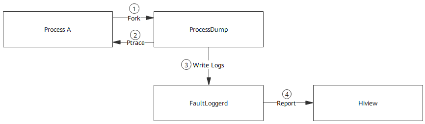

# FaultLoggerd<a name="EN-US_TOPIC_0000001162014039"></a>

-   [Introduction](#section11660541593)
-   [Directory Structure](#section161941989596)
-   [Usage](#section14197309111)
-   [Repositories Involved](#section1371113476307)

## Introduction<a name="section11660541593"></a>

FaultLoggerd is the module of OpenHarmony that generates and manages temporary C and C++ runtime crash logs.

**Figure  1**  FaultLoggerd log generation process<a name="fig4460722185514"></a>  




1. After detecting an abnormal signal, the signal handler of process A forks a child process and starts the ProcessDump tool.

2. The ProcessDump tool initiates a Ptrace to the parent process to read information, such as the register and call stack, about the thread that delivers the abnormal signal.

3. On obtaining the information, the ProcessDump tool writes logs to the FaultLoggerd module for temporary storage.

4. The FaultLoggerd module reports the fault to Hiview, if present, for subsequent processing.

## Directory Structure<a name="section161941989596"></a>

```
/base/hiviewdfx/faultloggerd
├── common                        # Common definitions
├── interfaces                    # External APIs
│   └── innerkits                 # Header files for internal subsystems
│       └── faultloggerd_client   # Internal APIs of the FaultLoggerd client
│       └── signal_handler        # Internal APIs of the signal handler
├── services                      # FaultLoggerd services
│   └── config                    # Startup configuration
├── tools                         # Tools
│   └── crasher                   # Crash tester
│   └── process_dump              # ProcessDump tool
```

## Usage<a name="section14197309111"></a>

If an application crashes, a temporary file will be generated in  **/data/log/faultlog/temp**. You can locate system crash faults based on logs.

## Repositories Involved<a name="section1371113476307"></a>

[DFX subsystem](https://gitee.com/openharmony/docs/blob/master/en/readme/dfx.md)

[hiviewdfx\_hiview](https://gitee.com/openharmony/hiviewdfx_hiview/blob/master/README.md)

[hiviewdfx\_hilog](https://gitee.com/openharmony/hiviewdfx_hilog/blob/master/README.md)

[hiviewdfx\_hiappevent](https://gitee.com/openharmony/hiviewdfx_hiappevent/blob/master/README.md)

[hiviewdfx\_hisysevent](https://gitee.com/openharmony/hiviewdfx_hisysevent/blob/master/README.md)

**hiviewdfx\_faultloggerd**

[hiviewdfx\_hilog\_lite](https://gitee.com/openharmony/hiviewdfx_hilog_lite/blob/master/README.md)

[hiviewdfx\_hievent\_lite](https://gitee.com/openharmony/hiviewdfx_hievent_lite/blob/master/README.md)

[hiviewdfx\_hiview\_lite](https://gitee.com/openharmony/hiviewdfx_hiview_lite/blob/master/README.md)

