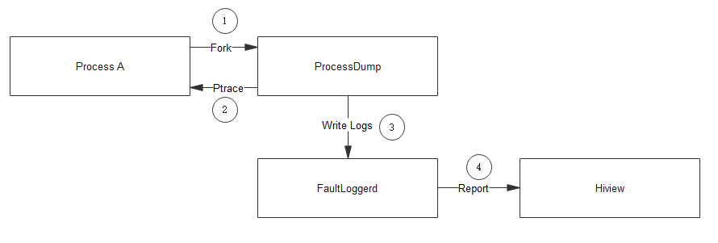

# FaultLoggerd组件<a name="ZH-CN_TOPIC_0000001162014039"></a>

-   [简介](#section11660541593)
-   [目录](#section161941989596)
-   [使用](#section14197309111)
-   [相关仓](#section1371113476307)

## 简介<a name="section11660541593"></a>

FaultLoggerd 是OpenHarmony中的C/C++运行时崩溃临时日志的生成及管理模块。

**图 1**  FaultLoggerd日志生成流程图<a name="fig4460722185514"></a>  




1.进程A的异常信号处理器检测到异常信号后Fork出子进程，并运行ProcessDump程序。

2.ProcessDump程序Ptrace到父进程上，读取异常线程相关信息，包括寄存器以及调用栈。

3.ProcessDump程序在读取异常信息后将日志写入到FaultLoggerd中做临时存储。

4.FaultLoggerd在Hiview没有被裁剪的情况下会将故障上报给Hiview进行后续的处理。

## 目录<a name="section161941989596"></a>

```
/base/hiviewdfx/faultloggerd
├── common                        # 公共定义
├── interfaces                    # 对外接口存放目录
│   └── innerkits                 # 对内部子系统暴露的头文件存放目录
│       └── faultloggerd_client   # 崩溃临时日志管理服务客户端内部接口
│       └── signal_handler        # 异常信号处理器内部接口
├── services                      # 崩溃临时日志管理服务
│   └── config                    # 启动配置
├── tools                         # 工具
│   └── crasher                   # 崩溃测试工具
│   └── process_dump              # 进程信息抓取工具
```

## 使用<a name="section14197309111"></a>

应用程序崩溃后会在/data/log/faultlog/temp路径下生成临时文件。系统开发者可以通过日志定位崩溃问题。

## 相关仓<a name="section1371113476307"></a>

[DFX子系统](https://gitee.com/openharmony/docs/blob/master/zh-cn/readme/DFX%E5%AD%90%E7%B3%BB%E7%BB%9F.md)

[hiviewdfx\_hiview](https://gitee.com/openharmony/hiviewdfx_hiview/blob/master/README_zh.md)

[hiviewdfx\_hilog](https://gitee.com/openharmony/hiviewdfx_hilog/blob/master/README_zh.md)

[hiviewdfx\_hiappevent](https://gitee.com/openharmony/hiviewdfx_hiappevent/blob/master/README_zh.md)

[hiviewdfx\_hisysevent](https://gitee.com/openharmony/hiviewdfx_hisysevent/blob/master/README_zh.md)

**hiviewdfx\_faultloggerd**

[hiviewdfx\_hilog\_lite](https://gitee.com/openharmony/hiviewdfx_hilog_lite/blob/master/README_zh.md)

[hiviewdfx\_hievent\_lite](https://gitee.com/openharmony/hiviewdfx_hievent_lite/blob/master/README_zh.md)

[hiviewdfx\_hiview\_lite](https://gitee.com/openharmony/hiviewdfx_hiview_lite/blob/master/README_zh.md)

