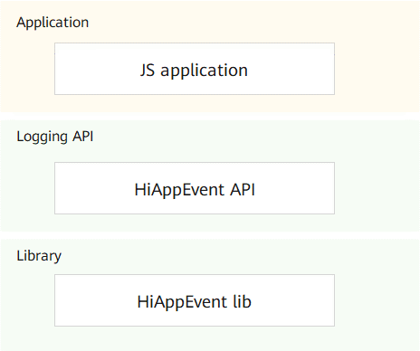

# HiAppEvent<a name="EN-US_TOPIC_0000001162014029"></a>

-   [Introduction](#section11660541593)
-   [Directory Structure](#section161941989596)
-   [Compilation and Building](#section137768191623)
-   [Description](#section1312121216216)
    -   [Available APIs](#section1551164914237)
    -   [Usage](#section129654513264)

-   [Repositories Involved](#section1371113476307)

## Introduction<a name="section11660541593"></a>

HiAppEvent is the module of OpenHarmony that provides the event logging function for applications to log the fault, statistical, security, and user behavior events reported during running. Based on event information, you will be able to analyze the running status of apps.

**Figure  1**  HiAppEvent architecture<a name="fig32154874419"></a>  


## Directory Structure<a name="section161941989596"></a>

```
/base/hiviewdfx/hiappevent   # HiAppEvent source code
├── frameworks               # Framework code
│   └── native               # Native implementation code of logging APIs
├── interfaces               # External APIs
│   └── js                   # JS APIs
│       └── innerkits        # JS API implementation code
│           └── napi         # JS APIs implemented based on NAPI
```

## Compilation and Building<a name="section137768191623"></a>

The minimum version requirements are Clang 8.0.0 and C++11. 

## Description<a name="section1312121216216"></a>

### Available APIs<a name="section1551164914237"></a>

**Table  1**  JS logging APIs

<a name="table107919166559"></a>
<table><thead align="left"><tr id="row1880201655520"><th class="cellrowborder" valign="top" width="15.981598159815983%" id="mcps1.2.4.1.1"><p id="p5801164558"><a name="p5801164558"></a><a name="p5801164558"></a>Module</p>
</th>
<th class="cellrowborder" valign="top" width="50.68506850685068%" id="mcps1.2.4.1.2"><p id="p168019163559"><a name="p168019163559"></a><a name="p168019163559"></a>API</p>
</th>
<th class="cellrowborder" valign="top" width="33.33333333333333%" id="mcps1.2.4.1.3"><p id="p780101685516"><a name="p780101685516"></a><a name="p780101685516"></a>Description</p>
</th>
</tr>
</thead>
<tbody><tr id="row148011162552"><td class="cellrowborder" valign="top" width="15.981598159815983%" headers="mcps1.2.4.1.1 "><p id="p188061611553"><a name="p188061611553"></a><a name="p188061611553"></a>hiappevent</p>
</td>
<td class="cellrowborder" valign="top" width="50.68506850685068%" headers="mcps1.2.4.1.2 "><p id="p1880171695519"><a name="p1880171695519"></a><a name="p1880171695519"></a>write(string eventName, EventType type, any... keyValues, function callback)</p>
</td>
<td class="cellrowborder" valign="top" width="33.33333333333333%" headers="mcps1.2.4.1.3 "><p id="p983410810310"><a name="p983410810310"></a><a name="p983410810310"></a>Implements asynchronous logging of application events.</p>
<p id="p683519817319"><a name="p683519817319"></a><a name="p683519817319"></a>Input parameters:</p>
<a name="ul108351681336"></a><a name="ul108351681336"></a><ul id="ul108351681336"><li><strong id="b989162817503"><a name="b989162817503"></a><a name="b989162817503"></a>eventName</strong>: Indicates the name of the application event.</li><li><strong id="b18115152795012"><a name="b18115152795012"></a><a name="b18115152795012"></a>type</strong>: Indicates the type of the application event.</li><li><strong id="b1296952585012"><a name="b1296952585012"></a><a name="b1296952585012"></a>keyValues</strong>: Indicates the key-value pairs of event parameters. The value is of a variable length.</li><li><strong id="b17387418122517"><a name="b17387418122517"></a><a name="b17387418122517"></a>callback</strong>: Indicates the callback function, which can be used to process the received return value. Value <strong id="b322243073516"><a name="b322243073516"></a><a name="b322243073516"></a>0</strong> indicates that the event parameter verification is successful, and the event will be written to the event file asynchronously. A value greater than 0 indicates that invalid parameters are present in the event, and the event will be written to the event file asynchronously after the invalid parameters are ignored. A value smaller than 0 indicates that the event parameter verification fails, and the event will not be written to the event file asynchronously.</li></ul>
</td>
</tr>
<tr id="row78021665512"><td class="cellrowborder" valign="top" width="15.981598159815983%" headers="mcps1.2.4.1.1 "><p id="p1380916165510"><a name="p1380916165510"></a><a name="p1380916165510"></a>hiappevent</p>
</td>
<td class="cellrowborder" valign="top" width="50.68506850685068%" headers="mcps1.2.4.1.2 "><p id="p1380161665518"><a name="p1380161665518"></a><a name="p1380161665518"></a>writeJson(string eventName, EventType type, object jsonObj, function callback)</p>
</td>
<td class="cellrowborder" valign="top" width="33.33333333333333%" headers="mcps1.2.4.1.3 "><p id="p12532811415"><a name="p12532811415"></a><a name="p12532811415"></a>Implements asynchronous logging of application events.</p>
<p id="p75313814417"><a name="p75313814417"></a><a name="p75313814417"></a>Input parameters:</p>
<a name="ul953681444"></a><a name="ul953681444"></a><ul id="ul953681444"><li><strong id="b94249195110"><a name="b94249195110"></a><a name="b94249195110"></a>eventName</strong>: Indicates the name of the application event.</li><li><strong id="b93897100518"><a name="b93897100518"></a><a name="b93897100518"></a>type</strong>: Indicates the type of the application event.</li><li><strong id="b15824911195111"><a name="b15824911195111"></a><a name="b15824911195111"></a>keyValues</strong>: Indicates the key-value pairs of event parameters. The value is in the JSON format.</li><li><strong id="b39492662519"><a name="b39492662519"></a><a name="b39492662519"></a>callback</strong>: Indicates the callback function, which can be used to process the received return value. Value <strong id="b42807842916"><a name="b42807842916"></a><a name="b42807842916"></a>0</strong> indicates that the event parameter verification is successful, and the event will be written to the event file asynchronously. A value greater than 0 indicates that invalid parameters are present in the event, and the event will be written to the event file asynchronously after the invalid parameters are ignored. A value smaller than 0 indicates that the event parameter verification fails, and the event will not be written to the event file asynchronously.</li></ul>
</td>
</tr>
</tbody>
</table>

### Usage<a name="section129654513264"></a>

**JS**

1.  Develop the source code.

    Import the HiAppEvent module.

    ```
    import hiappevent from '@ohos.hiappevent'
    ```

2.  Enable event logging for the application.

    ```
    // Callback mode
    hiappevent.write("testEvent", hiappevent.EventType.FAULT, "intData", 100, "strData", "strValue", (err, value) => {
        if (err) {
            // Event writing failed: The event contains invalid parameters or the event parameter verification fails.
            console.error(`failed to write event because ${err}`);
            return;
        }
    
        // Event writing succeeded.
        console.log(`success to write event: ${value}`);
    });
    
    // Promise mode
    hiappevent.write("testEvent", hiappevent.EventType.FAULT, "intData", 100, "strData", "strValue")
        .then((value) => {
            // Event writing succeeded.
            console.log(`success to write event: ${value}`);
        }).catch((err) => {
            // Event writing failed: The event contains invalid parameters or the event parameter verification fails.
            console.error(`failed to write event because ${err}`);
        });
    
    // Callback mode
    hiappevent.writeJson("testEvent", hiappevent.EventType.FAULT, {"intData":100, "strData":"strValue"}, (err, value) => {
        if (err) {
            // Event writing failed: The event contains invalid parameters or the event parameter verification fails.
            console.error(`failed to write event because ${err}`);
            return;
        }
    
        // Event writing succeeded.
        console.log(`success to write event: ${value}`);
    });
    
    // Promise mode
    hiappevent.writeJson("testEvent", hiappevent.EventType.FAULT, {"intData":100, "strData":"strValue"})
        .then((value) => {
            // Event writing succeeded.
            console.log(`success to write event: ${value}`);
        }).catch((err) => {
            // Event writing failed: The event contains invalid parameters or the event parameter verification fails.
            console.error(`failed to write event because ${err}`);
        });
    ```


## Repositories Involved<a name="section1371113476307"></a>

[DFX subsystem](https://gitee.com/openharmony/docs/blob/master/en/readme/dfx.md)

[hiviewdfx\_hiview](https://gitee.com/openharmony/hiviewdfx_hiview/blob/master/README.md)

[hiviewdfx\_hilog](https://gitee.com/openharmony/hiviewdfx_hilog/blob/master/README.md)

**hiviewdfx\_hiappevent**

[hiviewdfx\_hisysevent](https://gitee.com/openharmony/hiviewdfx_hisysevent/blob/master/README.md)

[hiviewdfx\_faultloggerd](https://gitee.com/openharmony/hiviewdfx_faultloggerd/blob/master/README.md)

[hiviewdfx\_hilog\_lite](https://gitee.com/openharmony/hiviewdfx_hilog_lite/blob/master/README.md)

[hiviewdfx\_hievent\_lite](https://gitee.com/openharmony/hiviewdfx_hievent_lite/blob/master/README.md)

[hiviewdfx\_hiview\_lite](https://gitee.com/openharmony/hiviewdfx_hiview_lite/blob/master/README.md)

