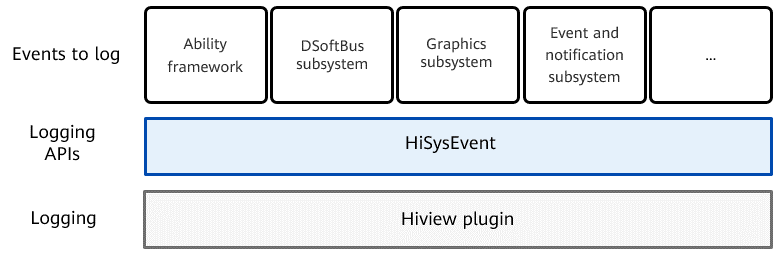

# HiSysEvent<a name="EN-US_TOPIC_0000001115694150"></a>

-   [Introduction](#section11660541593)
-   [Directory Structure](#section161941989596)
-   [Description](#section1312121216216)
    -   [Available APIs](#section1551164914237)
    -   [Sample Code](#section129654513264)

-   [Repositories Involved](#section1371113476307)

## Introduction<a name="section11660541593"></a>

HiSysEvent provides event logging APIs for OpenHarmony to record important information of key processes during system running, helping you locate faults. In addition, you can upload the log data to the cloud for big data analytics.

**Figure  1**  HiSysEvent architecture<a name="fig1514425244110"></a>  




## Directory Structure<a name="section161941989596"></a>

```
/base/hiviewdfx/hisysevent   # HiSysEvent source code
├── interfaces               # External APIs
    └── native               # C++ APIs
        └── innerkits        # C++ APIs opened to internal subsystems
```

## Description<a name="section1312121216216"></a>

### Available APIs<a name="section1551164914237"></a>

The following table lists the C++ APIs provided by the  **HiSysEvent**  class.

**Table  1**  C++ APIs provided by HiSysEvent

<a name="table1972602519328"></a>
<table><thead align="left"><tr id="row5726112593219"><th class="cellrowborder" valign="top" width="57.38999999999999%" id="mcps1.2.3.1.1"><p id="p1472602523216"><a name="p1472602523216"></a><a name="p1472602523216"></a>API</p>
</th>
<th class="cellrowborder" valign="top" width="42.61%" id="mcps1.2.3.1.2"><p id="p12726112512322"><a name="p12726112512322"></a><a name="p12726112512322"></a>Description</p>
</th>
</tr>
</thead>
<tbody><tr id="row47261259328"><td class="cellrowborder" valign="top" width="57.38999999999999%" headers="mcps1.2.3.1.1 "><p id="p15726112583213"><a name="p15726112583213"></a><a name="p15726112583213"></a>template&lt;typename... Types&gt; static int Write(const std::string &amp;domain, const std::string &amp;eventName, EventType type, Types... keyValues)</p>
</td>
<td class="cellrowborder" valign="top" width="42.61%" headers="mcps1.2.3.1.2 "><p id="p14727325133216"><a name="p14727325133216"></a><a name="p14727325133216"></a>Logs system events.</p>
<p id="p167271525203213"><a name="p167271525203213"></a><a name="p167271525203213"></a>Input parameters:</p>
<a name="ul0727102516327"></a><a name="ul0727102516327"></a><ul id="ul0727102516327"><li><strong id="b2019634817576"><a name="b2019634817576"></a><a name="b2019634817576"></a>domain</strong>: Indicates the domain related to the event. You can use a preconfigured domain or customize a domain as needed. The name of a custom domain can contain a maximum of 16 characters, including digits (0-9) and uppercase letters (A-Z). It must start with a letter.</li><li><strong id="b20954154912571"><a name="b20954154912571"></a><a name="b20954154912571"></a>eventName</strong>: Indicates the event name. The value contains a maximum of 32 characters, including digits (0 to 9), lowercase letters (a-z), uppercase letters (A-Z), and underscores (_). It must start with a letter and cannot end with an underscore (_).</li><li><strong id="b488285185718"><a name="b488285185718"></a><a name="b488285185718"></a>type</strong>: Indicates the event type. For details, see <strong id="b1667133015432"><a name="b1667133015432"></a><a name="b1667133015432"></a>EventType</strong>.</li><li><strong id="b19936135214571"><a name="b19936135214571"></a><a name="b19936135214571"></a>keyValues</strong>: Indicates the key-value pairs of event parameters. It can be in the format of the basic data type, <strong id="b79851431194316"><a name="b79851431194316"></a><a name="b79851431194316"></a>std::string</strong>, <strong id="b119861931204316"><a name="b119861931204316"></a><a name="b119861931204316"></a>std::vector<em id="i798503114317"><a name="i798503114317"></a><a name="i798503114317"></a>&lt;basic data type&gt;</em></strong>, or <strong id="b16986143164314"><a name="b16986143164314"></a><a name="b16986143164314"></a>std:vector&lt;std::string&gt;</strong>. The value contains a maximum of 48 characters, including digits (0 to 9), lowercase letters (a-z), uppercase letters (A-Z), and underscores (_). It must start with a letter and cannot end with an underscore (_). The number of parameter names cannot exceed 32.</li></ul>
<p id="p1727152513217"><a name="p1727152513217"></a><a name="p1727152513217"></a>Return value: If the operation is successful, <strong id="b277873515435"><a name="b277873515435"></a><a name="b277873515435"></a>0</strong> is returned. If the operation fails, a negative value is returned.</p>
</td>
</tr>
</tbody>
</table>

### Sample Code<a name="section129654513264"></a>

**C++**

1.  Develop the source code.

    Include the  **HiSysEvent**  header file in the class definition header file or class implementation source file. For example:

    ```
    #include "hisysevent.h"
    ```

    Add the event logging code. For example, if you want to log events specific to the app start time \(start\_app\), then add the following code to the service implementation source file:

    ```
    HiSysEvent::Write(HiSysEvent::Domain::AAFWK, "start_app", HiSysEvent::EventType::BEHAVIOR, "app_name", "com.demo");
    ```

2.  Configure compilation information. Specifically, add the subsystem SDK dependency to  **BUILD.gn**.

    ```
    external_deps = [ "hisysevent_native:libhisysevent" ]
    ```


## Repositories Involved<a name="section1371113476307"></a>

[DFX subsystem](https://gitee.com/openharmony/docs/blob/master/en/readme/dfx.md)

[hiviewdfx\_hiview](https://gitee.com/openharmony/hiviewdfx_hiview/blob/master/README.md)

[hiviewdfx\_hilog](https://gitee.com/openharmony/hiviewdfx_hilog/blob/master/README.md)

[hiviewdfx\_hiappevent](https://gitee.com/openharmony/hiviewdfx_hiappevent/blob/master/README.md)

**hiviewdfx\_hisysevent**

[hiviewdfx\_faultloggerd](https://gitee.com/openharmony/hiviewdfx_faultloggerd/blob/master/README.md)

[hiviewdfx\_hilog\_lite](https://gitee.com/openharmony/hiviewdfx_hilog_lite/blob/master/README.md)

[hiviewdfx\_hievent\_lite](https://gitee.com/openharmony/hiviewdfx_hievent_lite/blob/master/README.md)

[hiviewdfx\_hiview\_lite](https://gitee.com/openharmony/hiviewdfx_hiview_lite/blob/master/README.md)

