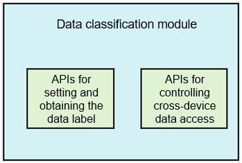

# dataclassification

-   [Introduction](#section11660541593)
-   [Architecture](#section342962219551)
-   [Available APIs](#section92711824195113)
-   [Repositories Involved](#section155556361910)

## Introduction

The data classification module of OpenHarmony provides hierarchical data protection policies and related APIs. \(Currently, OpenHarmony does not provide implementations for specific APIs. These APIs must be implemented by the device vendors to protect the security of data on OpenHarmony devices.\)

The data classification module provides the following APIs \(into two submodules\):

-   APIs for setting and obtaining the data label: With these APIs, you can set and obtain the security level of a file to be written to the disk.
-   APIs for controlling cross-device data access based on the device security level: The distributed cross-device data transmission service can use these APIs to obtain the highest data security level supported by the peer device.

The two submodules only contain API definitions, but do not implement these APIs. The following figure shows the architecture of the data classification module.

## Architecture

**Figure  1**  Architecture of the data classification module  

## Available APIs

**Table  1**  APIs provided by the data classification module

<table><thead align="left"><tr id="row84116107545"><th class="cellrowborder" valign="top" width="50%" id="mcps1.2.3.1.1">
API

</th>
<th class="cellrowborder" valign="top" width="50%" id="mcps1.2.3.1.2">
Description

</th>
</tr>
</thead>
<tbody><tr id="row1411110205418"><td class="cellrowborder" valign="top" width="50%" headers="mcps1.2.3.1.1 ">
int SetLabel(int userId, const char *filePath, const char *labelName, const char *labelValue, int flag);

</td>
<td class="cellrowborder" valign="top" width="50%" headers="mcps1.2.3.1.2 ">
Sets a specified label. Currently, this API returns success. You need to implement this function by yourself. You are advised to set the label in the extended attribute of a file. For details about the data security levels, see the developer documentation.

</td>
</tr>
<tr id="row10411710145415"><td class="cellrowborder" valign="top" width="50%" headers="mcps1.2.3.1.1 ">
int GetLabel(int userId, const char *filePath, const char *labelName, char *labelValue, const int valueLen);

</td>
<td class="cellrowborder" valign="top" width="50%" headers="mcps1.2.3.1.2 ">
Obtains the label. Currently, this API returns <strong id="b499513695911">S3</strong>. You need to implement this function by yourself. For details about the data security levels, see the developer documentation.

</td>
</tr>
<tr id="row1142121095419"><td class="cellrowborder" valign="top" width="50%" headers="mcps1.2.3.1.1 ">
int GetFlag(int userId, const char *filePath, const char *labelName);

</td>
<td class="cellrowborder" valign="top" width="50%" headers="mcps1.2.3.1.2 ">
Obtains the flag of a data security level. Currently, this API returns <strong id="b1887015618017">FLAG_FILE_PROTECTION_COMPLETE_UNLESS_OPEN</strong>. You need to implement this function by yourself. For details about the data security levels, see the developer documentation.

</td>
</tr>
<tr id="row10264187175820"><td class="cellrowborder" valign="top" width="50%" headers="mcps1.2.3.1.1 ">
int32_t DEVSL_GetHighestSecLevel(DEVSLQueryParams *queryParams, uint32_t *levelInfo);

</td>
<td class="cellrowborder" valign="top" width="50%" headers="mcps1.2.3.1.2 ">
Obtains the highest security level supported by the peer device. Currently, this API returns <strong id="b76381220139">S3</strong>. You need to implement this function by yourself. For details about the data security levels, see the developer documentation.

</td>
</tr>
<tr id="row18882199125920"><td class="cellrowborder" valign="top" width="50%" headers="mcps1.2.3.1.1 ">
int32_t DEVSL_OnStart(int32_t maxDevNum);

</td>
<td class="cellrowborder" valign="top" width="50%" headers="mcps1.2.3.1.2 ">
Initializes the data classification module. You need to implement this function by yourself.

</td>
</tr>
<tr id="row316118198591"><td class="cellrowborder" valign="top" width="50%" headers="mcps1.2.3.1.1 ">
void DEVSL_ToFinish(void);

</td>
<td class="cellrowborder" valign="top" width="50%" headers="mcps1.2.3.1.2 ">
Deinitializes the data classification module. You need to implement this function by yourself.

</td>
</tr>
</tbody>
</table>

## Repositories Involved

Security subsystem

**base/security/dataclassification**

