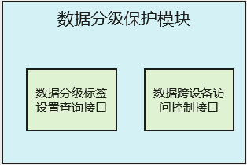

# 数据分级保护

-   [简介](#section11660541593)
-   [系统架构](#section342962219551)
-   [接口说明](#section92711824195113)
-   [相关仓](#section155556361910)

## 简介

在OpenHarmony中，数据分级保护模块负责提供数据分级的保护策略。数据分级保护模块提供了数据分级相关的接口定义。（OpenHarmony当前不提供实际的功能实现。依赖设备厂商实现接口对应的功能，对搭载OpenHarmony的设备上的数据提供安全保护）。

数据分级保护模块当前提供如下接口定义：

-   数据分级标签设置和查询接口：对业务生成的文件数据提供设置和查询风险等级标签的接口，业务可使用该接口设定和查询落盘文件数据的风险等级，使该文件在系统中具有对应的数据风险分级标识。
-   基于设备安全等级的数据跨设备访问控制接口：提供基于设备安全等级的数据跨设备访问控制的接口，分布式跨设备数据传输业务可使用该接口获得对端设备可支持的数据风险等级。

为实现上述接口定义，数据分级保护模块当前包含数据分级标签设置查询接口和基于设备安全等级的数据跨设备访问控制接口两个子模块，模块中仅包括接口定义，而不包含实际的功能实现，其部署逻辑如下图：

## 系统架构

**图 1**  数据分级保护子系统架构图  

## 接口说明

**表 1**  数据分级保护提供的API接口功能介绍

<table><thead align="left"><tr id="row84116107545"><th class="cellrowborder" valign="top" width="50%" id="mcps1.2.3.1.1">
接口名

</th>
<th class="cellrowborder" valign="top" width="50%" id="mcps1.2.3.1.2">
描述

</th>
</tr>
</thead>
<tbody><tr id="row1411110205418"><td class="cellrowborder" valign="top" width="50%" headers="mcps1.2.3.1.1 ">
int SetLabel(int userId, const char *filePath, const char *labelName, const char *labelValue, int flag);

</td>
<td class="cellrowborder" valign="top" width="50%" headers="mcps1.2.3.1.2 ">
设置风险等级标签能力，当前返回成功，设备厂商需自行实现标签风险等级设置能力。建议设置在文件的扩展属性中，数据风险等级更详细的定义描述参考开发者文档。

</td>
</tr>
<tr id="row10411710145415"><td class="cellrowborder" valign="top" width="50%" headers="mcps1.2.3.1.1 ">
int GetLabel(int userId, const char *filePath, const char *labelName, char *labelValue, const int valueLen);

</td>
<td class="cellrowborder" valign="top" width="50%" headers="mcps1.2.3.1.2 ">
查询风险等级标签能力，当前返回S3，设备厂商自行实现标签风险等级查询能力。数据风险等级更详细的定义描述参考开发者文档。

</td>
</tr>
<tr id="row1142121095419"><td class="cellrowborder" valign="top" width="50%" headers="mcps1.2.3.1.1 ">
int GetFlag(int userId, const char *filePath, const char *labelName);

</td>
<td class="cellrowborder" valign="top" width="50%" headers="mcps1.2.3.1.2 ">
查询风险等级的辅助信息，当前返回FLAG_FILE_PROTECTION_COMPLETE_UNLESS_OPEN，设备厂商自行实现标风险等级的辅助信息查询能力。数据风险等级更详细的定义描述参考开发者文档。

</td>
</tr>
<tr id="row10264187175820"><td class="cellrowborder" valign="top" width="50%" headers="mcps1.2.3.1.1 ">
int32_t DEVSL_GetHighestSecLevel(DEVSLQueryParams *queryParams, uint32_t *levelInfo);

</td>
<td class="cellrowborder" valign="top" width="50%" headers="mcps1.2.3.1.2 ">
获取对应设备可支持的数据风险等级，当前返回S3，设备厂商需自行实现该功能，数据风险等级更详细的定义描述参考开发者文档。

</td>
</tr>
<tr id="row18882199125920"><td class="cellrowborder" valign="top" width="50%" headers="mcps1.2.3.1.1 ">
int32_t DEVSL_OnStart(int32_t maxDevNum);

</td>
<td class="cellrowborder" valign="top" width="50%" headers="mcps1.2.3.1.2 ">
设备数据安全等级模块初始化，设备厂商需自行实现该功能。

</td>
</tr>
<tr id="row316118198591"><td class="cellrowborder" valign="top" width="50%" headers="mcps1.2.3.1.1 ">
void DEVSL_ToFinish(void);

</td>
<td class="cellrowborder" valign="top" width="50%" headers="mcps1.2.3.1.2 ">
设备数据安全等级模块去初始化，设备厂商需自行实现该功能。

</td>
</tr>
</tbody>
</table>

## 相关仓

安全子系统

base/security/dataclassification

