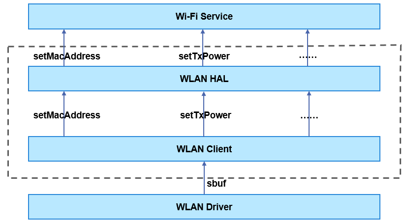

# WLAN<a name="EN-US_TOPIC_0000001078436908"></a>

-   [Introduction](#section11660541593)
-   [Directory Structure](#section161941989596)
-   [Available APIs](#section1564411661810)
-   [Usage Guidelines](#section19806524151819)
-   [Repositories Involved](#section1371113476307)

## Introduction<a name="section11660541593"></a>

This repository defines and implements the WLAN-related Hardware Driver Interfaces \(HDIs\) which provide the following functionalities:

1.  Creating and stopping a channel between the hardware abstraction layer \(HAL\) and the WLAN driver
2.  Obtaining the WLAN features supported by the device
3.  Creating a WLAN feature instance

**Figure  1**  WLAN driver module architecture<a name="fig14142101381112"></a>


## Directory Structure<a name="section161941989596"></a>

The directory structure of the WLAN repository is as follows:

```
/drivers/peripheral/wlan
├── client             # Client that implements the communication between the user space and kernel space
│   └── include       # Client header files
│   └── src           # Client code
├── hal                # HAL code
│   └── include       # HAL header files
│   └── src           # HAL code implementation
├── interfaces         # APIs exposed externally
│   └── include       # Header files containing APIs exposed externally
```

## Available APIs<a name="section1564411661810"></a>

The WLAN HAL module provides APIs for the Wi-Fi service, such as creating and destroying an  **IWiFi**  object and setting the MAC address.

**Table  1**  APIs provided by the WLAN HAL module

<a name="table1521573319472"></a>
<table><thead align="left"><tr id="row121519334474"><th class="cellrowborder" valign="top" width="15.079999999999998%" id="mcps1.2.4.1.1"><p id="p1221510339475"><a name="p1221510339475"></a><a name="p1221510339475"></a>Header File</p>
</th>
<th class="cellrowborder" valign="top" width="60.33%" id="mcps1.2.4.1.2"><p id="p0215153344716"><a name="p0215153344716"></a><a name="p0215153344716"></a>API</p>
</th>
<th class="cellrowborder" valign="top" width="24.59%" id="mcps1.2.4.1.3"><p id="p1421503315478"><a name="p1421503315478"></a><a name="p1421503315478"></a>Description</p>
</th>
</tr>
</thead>
<tbody><tr id="row112150333476"><td class="cellrowborder" rowspan="4" valign="top" width="15.079999999999998%" headers="mcps1.2.4.1.1 "><p id="p2155710125317"><a name="p2155710125317"></a><a name="p2155710125317"></a>wifi_hal.h</p>
<p id="p189132019183"><a name="p189132019183"></a><a name="p189132019183"></a></p>
</td>
<td class="cellrowborder" valign="top" width="60.33%" headers="mcps1.2.4.1.2 "><p id="p363110387399"><a name="p363110387399"></a><a name="p363110387399"></a>int32_t WifiConstruct(struct IWiFi **wifiInstance);</p>
</td>
<td class="cellrowborder" valign="top" width="24.59%" headers="mcps1.2.4.1.3 "><p id="p1363012387393"><a name="p1363012387393"></a><a name="p1363012387393"></a>Creates an <strong id="b1851191156"><a name="b1851191156"></a><a name="b1851191156"></a>IWiFi</strong> object with basic capabilities.</p>
</td>
</tr>
<tr id="row112151233194714"><td class="cellrowborder" valign="top" headers="mcps1.2.4.1.1 "><p id="p7629163817393"><a name="p7629163817393"></a><a name="p7629163817393"></a>int32_t WifiDestruct(struct IWiFi **wifiInstance);</p>
</td>
<td class="cellrowborder" valign="top" headers="mcps1.2.4.1.2 "><p id="p2627638173917"><a name="p2627638173917"></a><a name="p2627638173917"></a>Destroys an <strong id="b1088016455520"><a name="b1088016455520"></a><a name="b1088016455520"></a>IWiFi</strong> object.</p>
</td>
</tr>
<tr id="row1121533316475"><td class="cellrowborder" valign="top" headers="mcps1.2.4.1.1 "><p id="p4950434142314"><a name="p4950434142314"></a><a name="p4950434142314"></a>int32_t (*start)(struct IWiFi *);</p>
</td>
<td class="cellrowborder" valign="top" headers="mcps1.2.4.1.2 "><p id="p1162543816393"><a name="p1162543816393"></a><a name="p1162543816393"></a>Creates a channel between the HAL and the driver and obtains the NIC supported by the driver.</p>
</td>
</tr>
<tr id="row172153335473"><td class="cellrowborder" valign="top" headers="mcps1.2.4.1.1 "><p id="p162433816392"><a name="p162433816392"></a><a name="p162433816392"></a>int32_t (*stop)(struct IWiFi *);</p>
</td>
<td class="cellrowborder" valign="top" headers="mcps1.2.4.1.2 "><p id="p186235383393"><a name="p186235383393"></a><a name="p186235383393"></a>Stops the channel between the HAL and the driver.</p>
</td>
</tr>
<tr id="row451796205011"><td class="cellrowborder" rowspan="4" valign="top" width="15.079999999999998%" headers="mcps1.2.4.1.1 "><p id="p2659417135013"><a name="p2659417135013"></a><a name="p2659417135013"></a>wifi_hal_base_feature.h</p>
</td>
<td class="cellrowborder" valign="top" width="60.33%" headers="mcps1.2.4.1.2 "><p id="p15117233152315"><a name="p15117233152315"></a><a name="p15117233152315"></a>int32_t (*getFeatureType)(const struct IWiFiBaseFeature *);</p>
</td>
<td class="cellrowborder" valign="top" width="24.59%" headers="mcps1.2.4.1.3 "><p id="p195182610507"><a name="p195182610507"></a><a name="p195182610507"></a>Obtains the feature type.</p>
</td>
</tr>
<tr id="row5518663503"><td class="cellrowborder" valign="top" headers="mcps1.2.4.1.1 "><p id="p125181260501"><a name="p125181260501"></a><a name="p125181260501"></a>int32_t (*setMacAddress)(const struct IWiFiBaseFeature *, unsigned char *, uint8_t);</p>
</td>
<td class="cellrowborder" valign="top" headers="mcps1.2.4.1.2 "><p id="p1151815635014"><a name="p1151815635014"></a><a name="p1151815635014"></a>Sets the MAC address.</p>
</td>
</tr>
<tr id="row851915617503"><td class="cellrowborder" valign="top" headers="mcps1.2.4.1.1 "><p id="p20519865500"><a name="p20519865500"></a><a name="p20519865500"></a>int32_t (*getDeviceMacAddress)(const struct IWiFiBaseFeature *, unsigned char *, uint8_t);</p>
</td>
<td class="cellrowborder" valign="top" headers="mcps1.2.4.1.2 "><p id="p14519469509"><a name="p14519469509"></a><a name="p14519469509"></a>Obtains the device MAC address.</p>
</td>
</tr>
<tr id="row18519136185016"><td class="cellrowborder" valign="top" headers="mcps1.2.4.1.1 "><p id="p145195620502"><a name="p145195620502"></a><a name="p145195620502"></a>int32_t (*setTxPower)(const struct IWiFiBaseFeature *, int32_t);</p>
</td>
<td class="cellrowborder" valign="top" headers="mcps1.2.4.1.2 "><p id="p175191863503"><a name="p175191863503"></a><a name="p175191863503"></a>Sets the transmit power.</p>
</td>
</tr>
</tbody>
</table>

## Usage Guidelines<a name="section19806524151819"></a>

The following describes how to use the WLAN HAL module.

1.  Call the  **WifiConstruct**  function to create an  **IWiFi**  object.
2.  Use the created  **IWiFi**  object to call the  **start**  function to create a channel between the HAL and the driver and obtain the driver NIC information.
3.  Call the  **createFeature**  function to create an AP feature or station feature. You can call functions to perform operations on the created feature \(use an AP feature as an example\).
4.  Call functions to perform operations, such as calling the  **setMacAddress**  function to set the MAC address and calling the  **getDeviceMacAddress**  function to obtain the device MAC address.
5.  Call the  **destroyFeature**  function to destroy the created feature.
6.  Call the  **stop**  function to stop the channel between the HAL and the driver.
7.  Call the  **WifiDestruct**  function to destroy the  **IWiFi**  object.

The sample code is as follows:

```
#include "wifi_hal.h"
#include "wifi_hal_sta_feature.h"
#include "wifi_hal_ap_feature.h"
#include "wifi_hal_cmd.h"
#include "wifi_hal_event.h"

#define MAC_LEN 6

static void *hal_main()
{
    int ret;
    struct IWiFi *wifi;

    /* Create an IWiFi object. */
    ret = WifiConstruct(&wifi);
    if (ret != 0 || wifi == NULL) {
        return;
    }

    /* Create a channel between the HAL and the driver. */
    ret = wifi->start(wifi);
    if (ret != 0) {
        return;
    }

    /* Create an AP feature. */
    ret = wifi->createFeature(PROTOCOL_80211_IFTYPE_AP, (struct IWiFiBaseFeature **)&apFeature);
    if (ret != 0) {
        return;
    }

    /* Obtain the device MAC address. */
    unsigned char mac[MAC_LEN] = {0};
    ret = apFeature->baseFeature.getDeviceMacAddress((struct IWiFiBaseFeature *)apFeature, mac, MAC_LEN);
    if (ret != 0) {
        return;
    }

    /* Destroy the created AP feature. */
    ret = wifi->destroyFeature((struct IWiFiBaseFeature *)apFeature);
    if (ret != 0) {
        return;
    }

    /* Stop the created channel. */
    ret = wifi->stop(wifi);
    if (ret != 0) {
        return;
    }

    /* Destroy the created IWiFi object. */
    ret = WifiDestruct(&wifi);
    if (ret != 0) {
        return;
    }
    return;
}
```

## Repositories Involved<a name="section1371113476307"></a>

[Driver subsystem](https://gitee.com/openharmony/docs/blob/master/en/readme/driver-subsystem.md)

[drivers\_framework](https://gitee.com/openharmony/drivers_framework/blob/master/README.md)

[drivers\_adapter](https://gitee.com/openharmony/drivers_adapter/blob/master/README.md)

[drivers\_adapter\_khdf\_linux](https://gitee.com/openharmony/drivers_adapter_khdf_linux/blob/master/README.md)

drivers\_peripheral

