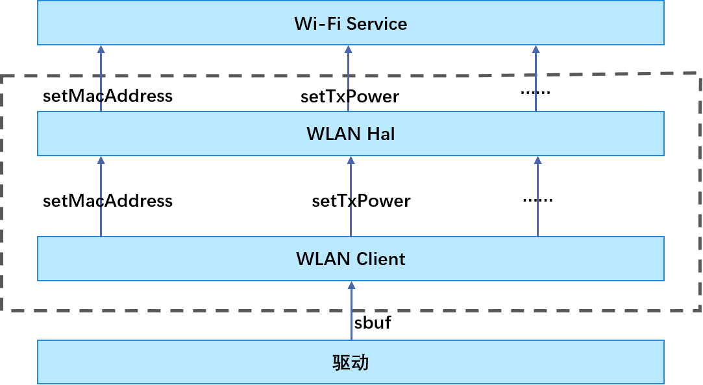

# WLAN<a name="ZH-CN_TOPIC_0000001078436908"></a>

-   [简介](#section11660541593)
-   [目录](#section161941989596)
-   [接口说明](#section1564411661810)
-   [使用说明](#section19806524151819)
-   [相关仓](#section1371113476307)

## 简介<a name="section11660541593"></a>

该仓下主要包含WLAN相关HDI接口与实现，提供功能包括：

1.  创建和销毁HAL层和WLAN驱动的通道；
2.  获取本设备支持的WLAN特性；
3.  创建特性所对应的实例等。

**图 1**  WLAN驱动模块架构图<a name="fig14142101381112"></a>


## 目录<a name="section161941989596"></a>

WLAN源代码目录结构如下所示：

```
/drivers/peripheral/wlan
├── client             # 实现用户态与内核态通信的client模块存放目录
│   └── include       # client相关头文件存放目录
│   └── src           # client代码存放目录
├── hal                # hal层框架代码
│   └── include       # hal内部头文件存放目录
│   └── src           # hal层代码的具体实现存放目录
├── interfaces         # 对外接口存放目录
│   └── include       # 对外提供的接口头文件存放目录
```

## 接口说明<a name="section1564411661810"></a>

WLAN驱动HAL模块提供给Wi-Fi service可直接调用的能力接口，主要功能有：创建/销毁 IWiFi对象、设置MAC地址等。提供的部分接口说明如下表所示：

**表 1**  hal层对外接口

<a name="table1521573319472"></a>
<table><thead align="left"><tr id="row121519334474"><th class="cellrowborder" valign="top" width="15.950000000000001%" id="mcps1.2.4.1.1"><p id="p1221510339475"><a name="p1221510339475"></a><a name="p1221510339475"></a>头文件</p>
</th>
<th class="cellrowborder" valign="top" width="59.46%" id="mcps1.2.4.1.2"><p id="p0215153344716"><a name="p0215153344716"></a><a name="p0215153344716"></a>接口名称</p>
</th>
<th class="cellrowborder" valign="top" width="24.59%" id="mcps1.2.4.1.3"><p id="p1421503315478"><a name="p1421503315478"></a><a name="p1421503315478"></a>功能描述</p>
</th>
</tr>
</thead>
<tbody><tr id="row112150333476"><td class="cellrowborder" rowspan="4" valign="top" width="15.950000000000001%" headers="mcps1.2.4.1.1 "><p id="p2155710125317"><a name="p2155710125317"></a><a name="p2155710125317"></a>wifi_hal.h</p>
<p id="p189132019183"><a name="p189132019183"></a><a name="p189132019183"></a></p>
</td>
<td class="cellrowborder" valign="top" width="59.46%" headers="mcps1.2.4.1.2 "><p id="p363110387399"><a name="p363110387399"></a><a name="p363110387399"></a>int32_t WifiConstruct(struct IWiFi **wifiInstance);</p>
</td>
<td class="cellrowborder" valign="top" width="24.59%" headers="mcps1.2.4.1.3 "><p id="p1363012387393"><a name="p1363012387393"></a><a name="p1363012387393"></a>创建IWiFi对象，提供IWiFi基本能力。</p>
</td>
</tr>
<tr id="row112151233194714"><td class="cellrowborder" valign="top" headers="mcps1.2.4.1.1 "><p id="p7629163817393"><a name="p7629163817393"></a><a name="p7629163817393"></a>int32_t WifiDestruct(struct IWiFi **wifiInstance);</p>
</td>
<td class="cellrowborder" valign="top" headers="mcps1.2.4.1.2 "><p id="p2627638173917"><a name="p2627638173917"></a><a name="p2627638173917"></a>销毁IWiFi对象。</p>
</td>
</tr>
<tr id="row1121533316475"><td class="cellrowborder" valign="top" headers="mcps1.2.4.1.1 "><p id="p4950434142314"><a name="p4950434142314"></a><a name="p4950434142314"></a>int32_t (*start)(struct IWiFi *);</p>
</td>
<td class="cellrowborder" valign="top" headers="mcps1.2.4.1.2 "><p id="p1162543816393"><a name="p1162543816393"></a><a name="p1162543816393"></a>创建HAL和驱动之间的通道及获取驱动支持的网卡信息。</p>
</td>
</tr>
<tr id="row172153335473"><td class="cellrowborder" valign="top" headers="mcps1.2.4.1.1 "><p id="p162433816392"><a name="p162433816392"></a><a name="p162433816392"></a>int32_t (*stop)(struct IWiFi *);</p>
</td>
<td class="cellrowborder" valign="top" headers="mcps1.2.4.1.2 "><p id="p186235383393"><a name="p186235383393"></a><a name="p186235383393"></a>销毁通道。</p>
</td>
</tr>
<tr id="row451796205011"><td class="cellrowborder" rowspan="4" valign="top" width="15.950000000000001%" headers="mcps1.2.4.1.1 "><p id="p2659417135013"><a name="p2659417135013"></a><a name="p2659417135013"></a>wifi_hal_base_feature.h</p>
</td>
<td class="cellrowborder" valign="top" width="59.46%" headers="mcps1.2.4.1.2 "><p id="p15117233152315"><a name="p15117233152315"></a><a name="p15117233152315"></a>int32_t (*getFeatureType)(const struct IWiFiBaseFeature *);</p>
</td>
<td class="cellrowborder" valign="top" width="24.59%" headers="mcps1.2.4.1.3 "><p id="p195182610507"><a name="p195182610507"></a><a name="p195182610507"></a>获取特性的类型。</p>
</td>
</tr>
<tr id="row5518663503"><td class="cellrowborder" valign="top" headers="mcps1.2.4.1.1 "><p id="p125181260501"><a name="p125181260501"></a><a name="p125181260501"></a>int32_t (*setMacAddress)(const struct IWiFiBaseFeature *, unsigned char *, uint8_t);</p>
</td>
<td class="cellrowborder" valign="top" headers="mcps1.2.4.1.2 "><p id="p1151815635014"><a name="p1151815635014"></a><a name="p1151815635014"></a>设置MAC地址。</p>
</td>
</tr>
<tr id="row851915617503"><td class="cellrowborder" valign="top" headers="mcps1.2.4.1.1 "><p id="p20519865500"><a name="p20519865500"></a><a name="p20519865500"></a>int32_t (*getDeviceMacAddress)(const struct IWiFiBaseFeature *, unsigned char *, uint8_t)；</p>
</td>
<td class="cellrowborder" valign="top" headers="mcps1.2.4.1.2 "><p id="p14519469509"><a name="p14519469509"></a><a name="p14519469509"></a>获取设备持久化的MAC地址。</p>
</td>
</tr>
<tr id="row18519136185016"><td class="cellrowborder" valign="top" headers="mcps1.2.4.1.1 "><p id="p145195620502"><a name="p145195620502"></a><a name="p145195620502"></a>int32_t (*setTxPower)(const struct IWiFiBaseFeature *, int32_t);</p>
</td>
<td class="cellrowborder" valign="top" headers="mcps1.2.4.1.2 "><p id="p175191863503"><a name="p175191863503"></a><a name="p175191863503"></a>设置发射功率。</p>
</td>
</tr>
</tbody>
</table>

## 使用说明<a name="section19806524151819"></a>

HAL模块使用步骤：

1.  使用WifiConstruct创建一个WiFi实体。
2.  用创建的WiFi实体调用start开启HAL和驱动之间的通道，获得驱动网卡信息。
3.  通过createFeature创建一个apFeature或者staFeature。后面可通过这些Feature去调用具体的实现接口。
4.  下面基于创建的apFeature调用和使用相关接口：如setMacAddress设置MAC地址、getDeviceMacAddress获取设备的MAC地址等。
5.  调用destroyFeature，销毁掉创建的这个Feature。
6.  调用stop销毁创建的通道。
7.  执行WifiDestruct销毁创建的WiFi实体。

代码示例：

```
#include "wifi_hal.h"
#include "wifi_hal_sta_feature.h"
#include "wifi_hal_ap_feature.h"
#include "wifi_hal_cmd.h"
#include "wifi_hal_event.h"

#define MAC_LEN 6

static void *hal_main()
{
    int ret;
    struct IWiFi *wifi;

    /* 创建一个WiFi实体 */
    ret = WifiConstruct(&wifi);
    if (ret != 0 || wifi == NULL) {
        return;
    }

    /* 开启HAL和驱动之间的通道 */
    ret = wifi->start(wifi);
    if (ret != 0) {
        return;
    }

    /* 创建apFeature */
    ret = wifi->createFeature(PROTOCOL_80211_IFTYPE_AP, (struct IWiFiBaseFeature **)&apFeature);
    if (ret != 0) {
        return;
    }

    /* 获取设备的MAC地址 */
    unsigned char mac[MAC_LEN] = {0};
    ret = apFeature->baseFeature.getDeviceMacAddress((struct IWiFiBaseFeature *)apFeature, mac, MAC_LEN);
    if (ret != 0) {
        return;
    }

    /* 销毁掉创建的这个Feature */
    ret = wifi->destroyFeature((struct IWiFiBaseFeature *)apFeature);
    if (ret != 0) {
        return;
    }

    /* 销毁创建的通道 */
    ret = wifi->stop(wifi);
    if (ret != 0) {
        return;
    }

    /* 销毁创建的WiFi实体 */
    ret = WifiDestruct(&wifi);
    if (ret != 0) {
        return;
    }
    return;
}
```

## 相关仓<a name="section1371113476307"></a>

[驱动子系统](https://gitee.com/openharmony/docs/blob/master/zh-cn/readme/%E9%A9%B1%E5%8A%A8%E5%AD%90%E7%B3%BB%E7%BB%9F.md)

[drivers\_framework](https://gitee.com/openharmony/drivers_framework/blob/master/README_zh.md)

[drivers\_adapter](https://gitee.com/openharmony/drivers_adapter/blob/master/README_zh.md)

[drivers\_adapter\_khdf\_linux](https://gitee.com/openharmony/drivers_adapter_khdf_linux/blob/master/README_zh.md)

drivers\_peripheral

