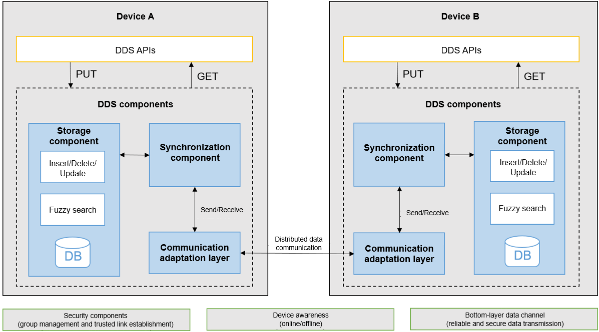

# distributeddatamgr\_distributeddatamgr<a name="EN-US_TOPIC_0000001124232845"></a>

-   [Introduction](#section11660541593)
-   [Directory Structure](#section161941989596)
-   [Constraints](#section119744591305)
-   [Description](#section1312121216216)
-   [Repositories Involved](#section1371113476307)

## Introduction<a name="section11660541593"></a>

Distributed Data Service \(DDS\) provides the capability to store data in the databases of different devices. DDS isolates data based on a triplet of the account, app, and database. DDS synchronizes data between trusted devices to provide users with consistent data access experience on different devices.

DDS manages data of OpenHarmony in a distributed manner. It consists of the following parts:

-   **Service interfaces**

    DDS provides APIs for other modules to create databases, access data, and subscribe to data. Supporting the KV data model and common data types, the APIs are highly compatible and easy to use, and can be released.

-   **Service component**

    The service component manages metadata, permissions, backup and restoration, and multiple users. It also initializes the storage and synchronization components and communication adaptation layer of the distributed database.

-   **Storage component**

    The storage component provides data access, data reduction, transactions, snapshots, data combination, and conflict resolution.

-   **Synchronization component**

    The synchronization component connects the storage and communication components. It maintains data consistency between online devices by synchronizing data generated on the local device to other devices and merging data received from other devices into the local device.

-   **Communication adaptation layer**

    The communication adaptation layer invokes interfaces of the public communication layer to create and connect to communication channels, receive device online and offline messages, maintain metadata of the connected and disconnected devices, send device online and offline messages to the synchronization component, synchronize the list of devices connected to and maintained by components, and invoke interfaces to encapsulate and send data to the connected devices.


You call APIs of DDS to create, access, and subscribe to distributed databases. The service interfaces store data to the storage component based on the capabilities provided by the service component. The storage component invokes the synchronization component to synchronize data. The synchronization component uses the communication adaptation layer to synchronize data to remote devices, which update the data in the storage component.

**Figure  1**  How DDS works<a name="fig371116145419"></a>  




## Directory Structure<a name="section161941989596"></a>

```
/foundation/distributeddatamgr/distributeddatamgr
├── interfaces                    # APIs
│   └── innerkits                 # Native APIs
├── services                      # Service code
│   └── distributeddataservice    # DDS implementation
└── test                          # Test case resources
```

## Constraints<a name="section119744591305"></a>

-   To use all functions of DDS, you need to obtain the  **ohos.permission.DISTRIBUTED\_DATASYNC**  permission.
-   DDS supports the KV data model, but not foreign keys or triggers of the relational database.
-   DDS supports the following KV data model specifications:
    -   For the device KV store, the maximum size of a key is 896 bytes, and that of a value is 4 MB.
    -   For the single KV store, the maximum size of a key is 1 KB, and that of a value is 4 MB. 
    -   Each app can open a maximum of 16 databases simultaneously.

-   DDS cannot completely replace the database in the service sandbox for storing data, because the storage types supported by them are not completely the same. You need to determine the data to be synchronized in distributed mode and store the data in DDS.
-   Currently, DDS does not allow customization of conflict resolution policies.
-   DDS supports a maximum of 1000  **KvStore**  API calls per second, and 10,000 per minute. It supports a maximum of 50  **KvManager**  API calls per second, and 500 per minute.

## Description<a name="section1312121216216"></a>

Some basic concepts related to the DDS are as follows:

-   **KV data model**

    KV is short for key-value. The KV database is a type of NoSQL database. Data in this type of database is organized, indexed, and stored in the form of key-value pairs.

    The KV data model is suitable for storing service data that does not involve too many data or service relationships. It provides better read and write performance than the SQL database. The KV data model is widely used in distributed scenarios because it handles conflict more easily in database version compatibility and data synchronization. The distributed database is based on the KV data model and provides KV-based access interfaces.

-   **Distributed database transactions**

    Distributed database transactions include local transactions \(same as the transactions of traditional databases\) and synchronization transactions. Synchronization transactions refer to data synchronization between devices in the unit of local transaction. Synchronization of a local transaction modification either succeeds or fails on multiple devices.

-   **Distributed database consistency**

    In a distributed scenario where multiple devices are used in the same network, distributed database consistency means that data is consistent on these devices. This consistency can be classified into strong, weak, and eventual consistency.

    -   **Strong consistency**: After data is inserted, deleted, or updated on a device, other devices in the same network will obtain the updated data.
    -   **Weak consistency**: After data is inserted, deleted, or updated on a device, other devices in the same network may or may not obtain the updated data. The time when all devices have the same data is uncertain.
    -   **Eventual consistency**: After data is inserted, deleted, or updated on a device, other devices in the same network may not obtain the updated data immediately. However, data on all the devices will become consistent after some time.

    Strong consistency has high requirements on distributed data management and may be used in distributed server scenarios. DDS supports only ultimate consistency because mobile devices are not always online and there is no center.

-   **Distributed database synchronization**

    After discovering and authenticating a device, the bottom-layer communication component notifies the DDS that the device goes online. After receiving the notification, DDS establishes an encrypted transmission channel to synchronize data between the two devices.

    DDS provides both manual and automatic synchronization. In manual synchronization, you can specify the list of target devices and the synchronization mode \(PULL, PUSH, or PULL\_PUSH\). In automatic synchronization, the distributed database synchronizes data \(when devices go online or data is modified\), and you are unaware of the synchronization.

-   **Single KV store**

    Data is saved locally in the unit of a single KV entry. Only one entry is saved for each key. When users modify data locally, the corresponding KV entry is modified, regardless of whether the data has been synchronized. As for synchronization, the latest modification is synchronized to remote devices.

-   **Device KV store**

    The device KV store is based on the single KV store and adds device IDs before the keys of key-value pairs. This ensures that the data generated by each device is isolated from each other and is centrally managed by the system. With the device KV store, you can query data of a specified device, but cannot modify the data synchronized from remote devices.

-   **Conflict resolution policy for the distributed database**

    A data conflict occurs when multiple devices modify the same data and commit the modification to the database. In this case, the default conflict resolution policy is used, that is, the data modification committed later takes effect. Currently, the conflict resolution policy cannot be customized.

-   **Schema-based database management and data query based on predicates**

    When creating or opening a single KV store, you can specify a schema. The database detects the value format of key-value pairs based on the schema and checks the value structure. In addition, the database provides index creation and predicate-based query functions based on the fields in the values.

-   **Distributed database backup capability**

    DDS provides the database backup capability. By setting  **backup**  to  **true**, you can trigger daily database backup. If a distributed database is damaged, DDS deletes the database and restores the most recent data from the backup database. If no backup database is available, DDS creates one. DDS can also back up encrypted databases.


## Repositories Involved<a name="section1371113476307"></a>

Distributed Data Management subsystem

distributeddatamgr\_distributeddatamgr

third\_party\_sqlite

third\_party\_flatbuffers

