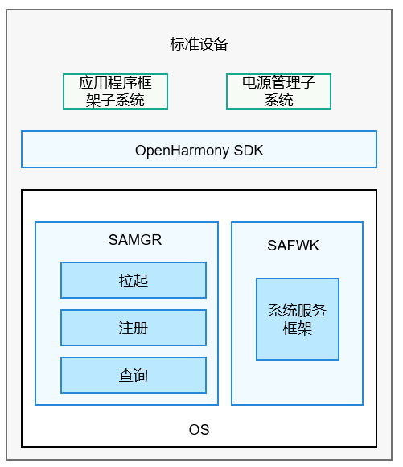

# samgr组件<a name="ZH-CN_TOPIC_0000001162068341"></a>

-   [简介](#section11660541593)
-   [目录](#section161941989596)
-   [说明](#section1312121216216)
-   [相关仓](#section1371113476307)

## 简介<a name="section11660541593"></a>

samgr组件是OpenHarmony的核心组件，提供OpenHarmony系统服务启动、注册、查询等功能。



## 目录<a name="section161941989596"></a>

```
/foundation/distributedschedule/services/samgr/
├── native
│   ├── BUILD.gn  # 部件编译脚本
│   ├── include   # 头文件存放目录
│   ├── samgr.rc  # samgr启动配置文件
│   ├── source    # 源代码存放目录
│   ├── test      # 测试代码存放目录
```

## 说明<a name="section1312121216216"></a>

1.  samgr服务接收到sa框架层发送的注册消息，会在本地缓存中存入系统服务相关信息。

    ```
    int32_t SystemAbilityManager::AddSystemAbility(int32_t systemAbilityId, const sptr<IRemoteObject>& ability,
        const SAExtraProp& extraProp)
    {
        if (!CheckInputSysAbilityId(systemAbilityId) || ability == nullptr || (!CheckCapability(extraProp.capability))) {
            HILOGE("AddSystemAbilityExtra input params is invalid.");
            return ERR_INVALID_VALUE;
        }
        {
            unique_lock<shared_mutex> writeLock(abilityMapLock_);
            auto saSize = abilityMap_.size();
            if (saSize >= MAX_SERVICES) {
                HILOGE("map size error, (Has been greater than %zu)", saSize);
                return ERR_INVALID_VALUE;
            }
            SAInfo saInfo;
            saInfo.remoteObj = ability;
            saInfo.isDistributed = extraProp.isDistributed;
            saInfo.capability = extraProp.capability;
            saInfo.permission = Str16ToStr8(extraProp.permission);
            abilityMap_[systemAbilityId] = std::move(saInfo);
            HILOGI("insert %{public}d. size : %zu,", systemAbilityId, abilityMap_.size());
        }
        if (abilityDeath_ != nullptr) {
            ability->AddDeathRecipient(abilityDeath_);
        }
        FindSystemAbilityManagerNotify(systemAbilityId, ADD_SYSTEM_ABILITY_TRANSACTION);
        u16string strName = Str8ToStr16(to_string(systemAbilityId));
        if (extraProp.isDistributed && dBinderService_ != nullptr) {
            dBinderService_->RegisterRemoteProxy(strName, ability);
            HILOGD("AddSystemAbility RegisterRemoteProxy, serviceId is %{public}d", systemAbilityId);
        }
        if (systemAbilityDataStorage_ == nullptr) {
            HILOGE("AddSystemAbility systemAbilityDataStorage not init!");
            return ERR_NO_INIT;
        }
        if (extraProp.isDistributed) {
            systemAbilityDataStorage_->ClearSyncRecords();
            DoInsertSaData(strName, ability, extraProp);
        }
    }
    ```

2.  对于本地服务而言，samgr服务接收到sa框架层发送的获取消息，会通过服务id，查找到对应服务的代理对象，然后返回给sa框架。

    ```
    sptr<IRemoteObject> SystemAbilityManager::CheckSystemAbility(int32_t systemAbilityId)
    {
        if (!CheckInputSysAbilityId(systemAbilityId)) {
            return nullptr;
        }
    
        std::string selectedDeviceId;
        if (CheckRemoteSa(to_string(systemAbilityId), selectedDeviceId)) {
           return CheckSystemAbility(systemAbilityId, selectedDeviceId);
        }
    
        shared_lock<shared_mutex> readLock(abilityMapLock_);
        auto iter = abilityMap_.find(systemAbilityId);
        if (iter != abilityMap_.end()) {
            auto callingUid = IPCSkeleton::GetCallingUid();
            if (IsSystemApp(callingUid) || CheckPermission(iter->second.permission)) {
                 return iter->second.remoteObj;
            }
            return nullptr;
        }
        return nullptr;
    }
    ```


## 相关仓<a name="section1371113476307"></a>

分布式任务调度子系统

distributedschedule\_dms\_fwk

distributedschedule\_safwk

**distributedschedule\_samgr**

distributedschedule\_safwk\_lite

hdistributedschedule\_samgr\_lite

distributedschedule\_dms\_fwk\_lite

