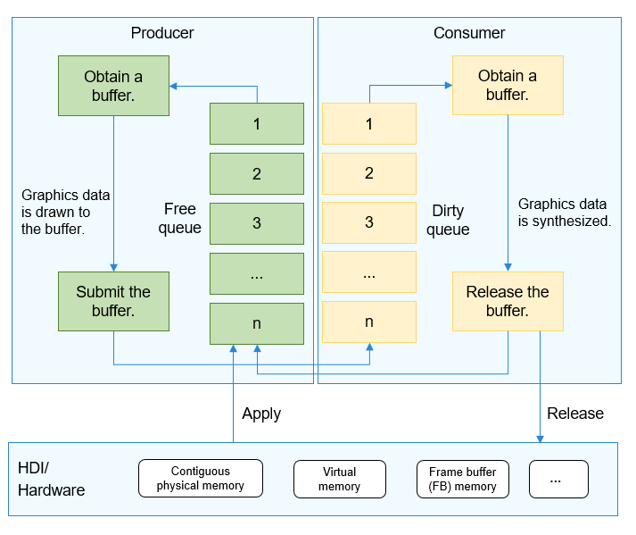

# Surface<a name="EN-US_TOPIC_0000001078362030"></a>

-   [Introduction](#section11660541593)
-   [Directory Structure](#section161941989596)
-   [Compilation and Building](#section137768191623)
-   [Description](#section1312121216216)
    -   [Process Description](#section1551164914237)
    -   [Usage](#section129654513264)

-   [Repositories Involved](#section1371113476307)

## Introduction<a name="section11660541593"></a>

A surface is used to manage and transfer the shared memory of graphics and media. Specific use cases include graphics display and composition, and media playback and recording.

A surface transfers data across processes through control structures such as Inter-Process Communication \(IPC\) handles \(with copies\), and transfers graphics and media data \(zero-copy\) through shared memory. The following figure shows the position where a surface works in the system architecture. The elements in green blocks are surface buffers.

**Figure  1**  Position of a surface in the system architecture<a name="fig584223343312"></a>  


## Directory Structure<a name="section161941989596"></a>

```
/foundation/graphic/surface
├── frameworks       # Framework code
├── interfaces       # APIs
│   ├── innerkits    # APIs between modules
│   └── kits         # External APIs
└── test             # Test code
    ├── fuzztest     # Fuzzing
    └── unittest     # Unit testing
```

## Compilation and Building<a name="section137768191623"></a>

```
# Generate the libsurface.so file in the out directory of the product folder through GN compilation.
hb build lite_surface
```

## Description<a name="section1312121216216"></a>

### Process Description<a name="section1551164914237"></a>

Take the interaction between Window Manager Service \(WMS\) and UI as an example. UI works as a producer, and WMS works as a consumer.

The producer obtains a buffer from the free queue, draws the UI content into the buffer, and places the buffer in the dirty queue.

The consumer obtains the buffer from the dirty queue, synthesizes graphics data, and places the buffer in the free queue again.

**Figure  2**  Surface rotation process<a name="fig126141128261"></a>  


> **NOTICE:** 
>1.  A shared memory is used for data transfer, and the task of managing the shared memory runs in the process of creating a surface for the first time. If the process is abnormal and is not recycled, severe memory leakage occurs. Therefore, pay special attention to the process.
>2.  Surfaces are generally used for cross-process transfers of large memory blocks \(such as display data\) in graphics or media. Especially, when continuous physical memory is used, the transfer rate can be greatly improved. It is not recommended that surfaces be used in small-memory transfer scenarios. Otherwise, memory fragmentation may occur, which affects the performance in typical scenarios.

### Usage<a name="section129654513264"></a>

For details, see  [WMS](en-us_topic_0000001122925147.md).

## Repositories Involved<a name="section1371113476307"></a>

[Graphic subsystem](https://gitee.com/openharmony/docs/blob/master/en/readme/graphics-subsystem.md)

[graphic_wms](https://gitee.com/openharmony/graphic_wms/blob/master/README.md)

**graphic_surface**

[graphic_ui](https://gitee.com/openharmony/graphic_ui/blob/master/README.md)

[graphic_utils](https://gitee.com/openharmony/graphic_utils/blob/master/README.md)