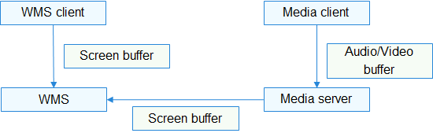
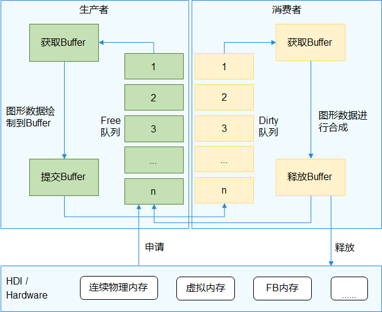

# 图形SURFACE组件<a name="ZH-CN_TOPIC_0000001078362030"></a>

-   [简介](#section11660541593)
-   [目录](#section161941989596)
-   [编译构建](#section137768191623)
-   [说明](#section1312121216216)
    -   [流程说明](#section1551164914237)
    -   [使用说明](#section129654513264)

-   [相关仓](#section1371113476307)

## 简介<a name="section11660541593"></a>

Surface组件用于管理和传递图形和媒体的共享内存。具体场景包括了图形的送显、合成，媒体的播放、录制等。

Surface的跨进程传输使用IPC传输句柄等控制结构（有拷贝），使用共享内存传递图形/媒体数据（零拷贝）。

**图 1**  surface在系统架构中的位置（绿色部分为surface buffer）<a name="fig584223343312"></a>  


## 目录<a name="section161941989596"></a>

```
/foundation/graphic/surface
├── frameworks       # 框架代码
├── interfaces       # 接口
│   ├── innerkits    # 模块间接口
│   └── kits         # 对外接口
└── test             # 测试代码
    ├── fuzztest     # fuzz测试
    └── unittest     # 单元测试
```

## 编译构建<a name="section137768191623"></a>

```
# 通过gn编译,在out目录下对应产品的文件夹中生成libsurface.so
hb build lite_surface
```

## 说明<a name="section1312121216216"></a>

### 流程说明<a name="section1551164914237"></a>

以WMS组件和UI组件交互为例，UI为生产者，WMS为消费者。

生产者：从Free队列中获取Buffer，将UI内容绘制到Buffer中，然后将Buffer放到Dirty队列；

消费者：从Dirty队列中获取Buffer并进行合成，然后将Buffer重新放到Free队列中。

**图 2**  Surface轮转流程<a name="fig126141128261"></a>  


> **须知：** 
>1.  由于使用了共享内存，而共享内存的管理任务在首次创建Surface的进程中，因此需要对该进程格外关注，如果发生进程异常且没有回收处理会发生严重的内存泄漏；
>2.  Surface一般用作图形/媒体中大块内存的跨进程传输（如显示数据），尤其在使用了连续物理内存的情况下，可以大幅提高传输速率。不建议用在小内存传输的场景，容易造成内存碎片化影响典型场景的性能。

### 使用说明<a name="section129654513264"></a>

可参考图形[图形WMS组件](zh-cn_topic_0000001122925147.md)。

## 相关仓<a name="section1371113476307"></a>

[图形子系统](https://gitee.com/openharmony/docs/blob/master/zh-cn/readme/%E5%9B%BE%E5%BD%A2%E5%AD%90%E7%B3%BB%E7%BB%9F.md)

[graphic_wms](https://gitee.com/openharmony/graphic_wms/blob/master/README_zh.md)

**graphic_surface**

[graphic_ui](https://gitee.com/openharmony/graphic_ui/blob/master/README_zh.md)

[graphic_utils](https://gitee.com/openharmony/graphic_utils/blob/master/README_zh.md)