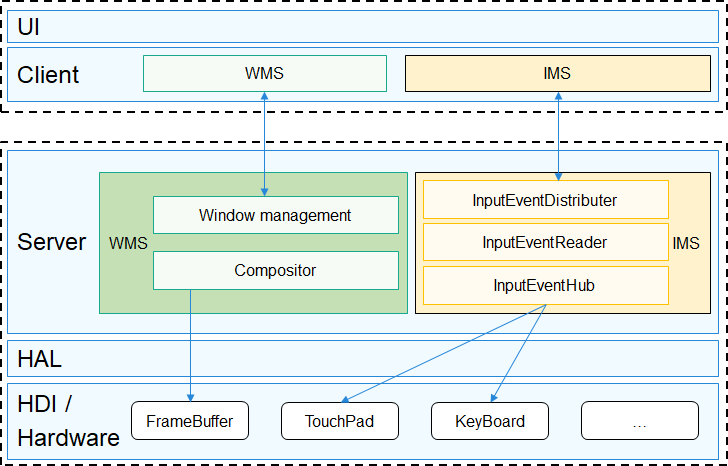

# WMS<a name="EN-US_TOPIC_0000001122925147"></a>

-   [Introduction](#section11660541593)
-   [Directory Structure](#section161941989596)
-   [Compilation and Building](#section137768191623)
-   [Description](#section1312121216216)
    -   [Usage](#section129654513264)

-   [Repositories Involved](#section1371113476307)

## Introduction<a name="section11660541593"></a>

The graphics service uses the client/server \(C/S\) architecture and is divided into two sub-services: Window Manager Service \(WMS\) and Input Manager Service \(IMS\). The application calls the APIs provided by the client to obtain the window status and process events. The server interacts with the hardware to implement display and input event distribution.

-   WMS: Manages and combines windows of different applications in a unified manner. Each window is bound to a  **RootView**  object.
-   IMS: Connects to the underlying input event driver framework to monitor and distribute input events.

**Figure  1** <a name="fig163546295165"></a>  




## Directory Structure<a name="section161941989596"></a>

```
/foundation/graphic/wms
├── frameworks      # Client
│   ├── ims         # Input event management service client
│   └── wms         # Window management service client
├── interfaces      # APIs
│   ├── innerkits   # APIs between modules
├── services        # Server
│   ├── ims         # Input event management service
│   └── wms         # Window management service
└── test            # Test code
```

## Compilation and Building<a name="section137768191623"></a>

```
# Generate the wms_server and libwms_client.so files in the out directory of the product folder through GN compilation.
hb build lite_wms
```

## Description<a name="section1312121216216"></a>

### Usage<a name="section129654513264"></a>

-   WMS provides methods to display various UI components, send event notifications, and process various events. For details, see the related source code.
-   **test/sample\_window**  provides the unit testing for each WMS API. Refer to it for the usage of WMS.

## Repositories Involved<a name="section1371113476307"></a>

[Graphic subsystem](https://gitee.com/openharmony/docs/blob/master/en/readme/graphics-subsystem.md)

**graphic_wms**

[graphic_surface](https://gitee.com/openharmony/graphic_surface/blob/master/README.md)

[graphic_ui](https://gitee.com/openharmony/graphic_ui/blob/master/README.md)

[graphic_utils](https://gitee.com/openharmony/graphic_utils/blob/master/README.md)